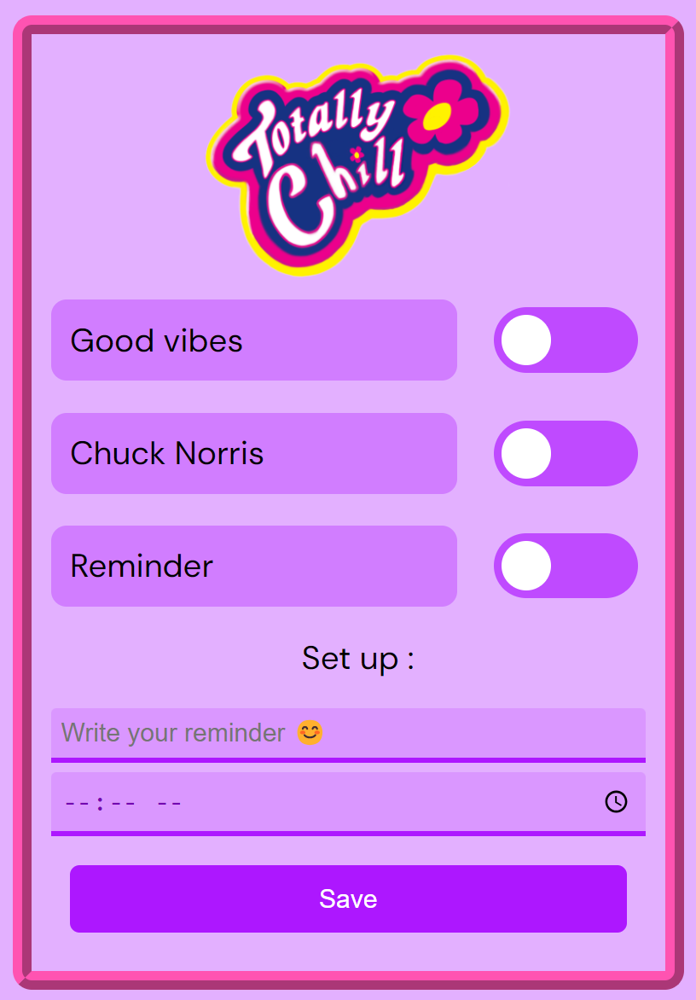

# Création d'une extension Chrome

  

Une extension chrome avec différents rappels  à utiliser en formation ou au travail:
  - programmer des rappels personnalisés et programmables selon l'heure.
  - phrases aléatoires de Chuck Norris sur le theme du developpement web.
  - phrases aléatoires pour nous rappeller de prendre des pauses, de demander de l'aide, de s'étirer, de boire de l'eau ...

Objectifs : 
  - Comprendre comment fonctionne une extension avec son manifest
  - Utilisation de Sass pour le style.
  - Utilisation des fonctionnalités chrome pour créer des notifications.

  

